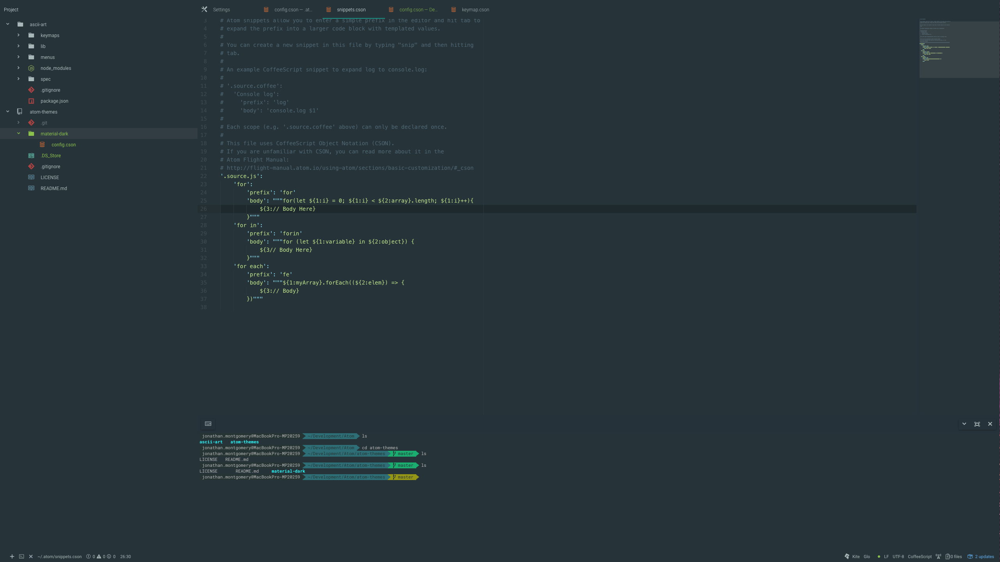
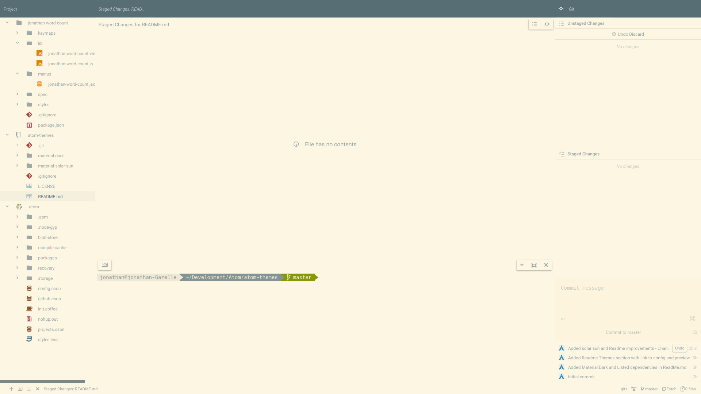

# Atom Themes
A collection of full fledged atom theme settings. Looks great with
zshell and the agnoster theme for zshell.

# Install

### Manual Override
Go to your atom home directory usually `~/.atom/config.cson` and apply the
key value pairs that you would like from the theme's `config.cson`. Do the same
thing for the [./styles.less](./styles.less) in the root of this project folder and apply this
over atoms `styles.less` in the atom home directory usually `~/.atom/styles.less`.

### Theme Setting Binder Install
(Comming Soon)

### Atom

#### Common Atom Packages
- [platformio-terminal](https://atom.io/packages/platformio-ide-terminal)
  ```sh
  apm install platformio-ide-terminal
  ```

#### Common Atom Themes
- [atom-material-ui](https://atom.io/themes/atom-material-ui)
  ```sh
  apm install atom-material-ui
  ```
- [atom-material-syntax](https://atom.io/themes/atom-material-syntax)
  ```sh
  apm install atom-material-syntax
  ```

### Z-Shell

#### Install Oh-My-Zshell
- [Install](https://github.com/andresteingress/oh-my-zsh)

#### Theme

- [Agnoster](https://github.com/agnoster/agnoster-zsh-theme)
- [Powerline Patched Fonts](https://github.com/powerline/fonts) (Needed for agnoster)

# Themes

## Material Dark
- [Atom Config](./material-dark/config.cson)

  

## Material Solar Sun
- [Atom Config](./material-solar-sun/config.cson)

  

## (Coming Soon Material Solar Moon)
